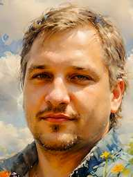

# Nikolay Negriy


# Contact information:
* E-mail: nnegriy@gmail.com
* Discord: @np_n_

# Objective
I started my career in an information agency as a web developer, but was soon forced to change my field of activity. During this time web-technology has gone far ahead. I hope my studies at RS-School will help me to bridge this gap becoming a proficient Fullstack Developer (there is an experience developing have been programming the backend on Oracle software solutions).

# Briefly About Myself:
I have been working in the IT field for more than 20 years. In my work, I try to close the uncovered areas of work in the department as much as possible, so during this time I worked in different positions. Sometimes the field of activity had to be changed radically. I like to acquire new skills and knowledge, as well as apply them in practice. 


# Work experience
* Software developer -> lead software engineer -> main specialist JSC STN (11.2012 – present time)

* Engineer (system administrator, network engineer) of the Information Technology Department, branch of JSC STN (12.2007 – 11.2012)

* Software developer "Laboratory of Systems 321" (09.2007 – 12.2007)

* Software developer, system administrator of Delovoy Omsk Information Agency LLC (09.2002 – 08.2007)

* Software developer, database administrator “IMEK" – Institute of Management of Informatics and Economics of Omsk State University of Railway Engineering (01.2002 – 09.2002)

# Education
Omsk State University of Railway Engineering (September 1994 – June 2000), higher technical education, engineer qualification, specialty “Management and Computer Science in Technical systems".

# Qualifications
* RS Schools Course «JavaScript/Front-end. Stage 0» (in progress)

* Yandex.Practicum DevOps for operation and development (in progress)

* Sunday School of Thumbtack Developers (2019), Omsk

* Authorized Oracle Training Center "Sibinfocenter", Novosibirsk (February 2011): 11gNF (11g: new features)

* Authorized Cisco Training Center "Sibinfocenter", Novosibirsk (November 2010): Interconnect Cisco Networking Devices Part 1 (ICND1)

* Oracle OCP DBA 10g (June 2010)
 
* Oracle OCA DBA 10g (November 2007)

* Authorized Oracle Training Center "Sibinfocenter", Novosibirsk (March 2007): 10gDBAII  (Administration of Oracle 10g. Part II)

# Skills
Oracle PL/SQL,
HTML, CSS, JavaScript Basics
Git, VS Code

# Code example
Sum of two smallest numbers from array KATA from CODEWARS:

```
function sumTwoSmallestNumbers(numbers) {
  var arr = numbers.sort((a, b) => (a - b));
  return arr[0] + arr[1];
};
```

# Languages:
* Russian - Native
* English - Pre Intermediate